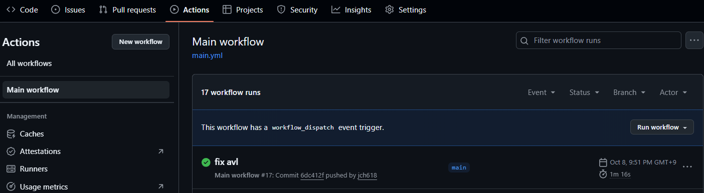
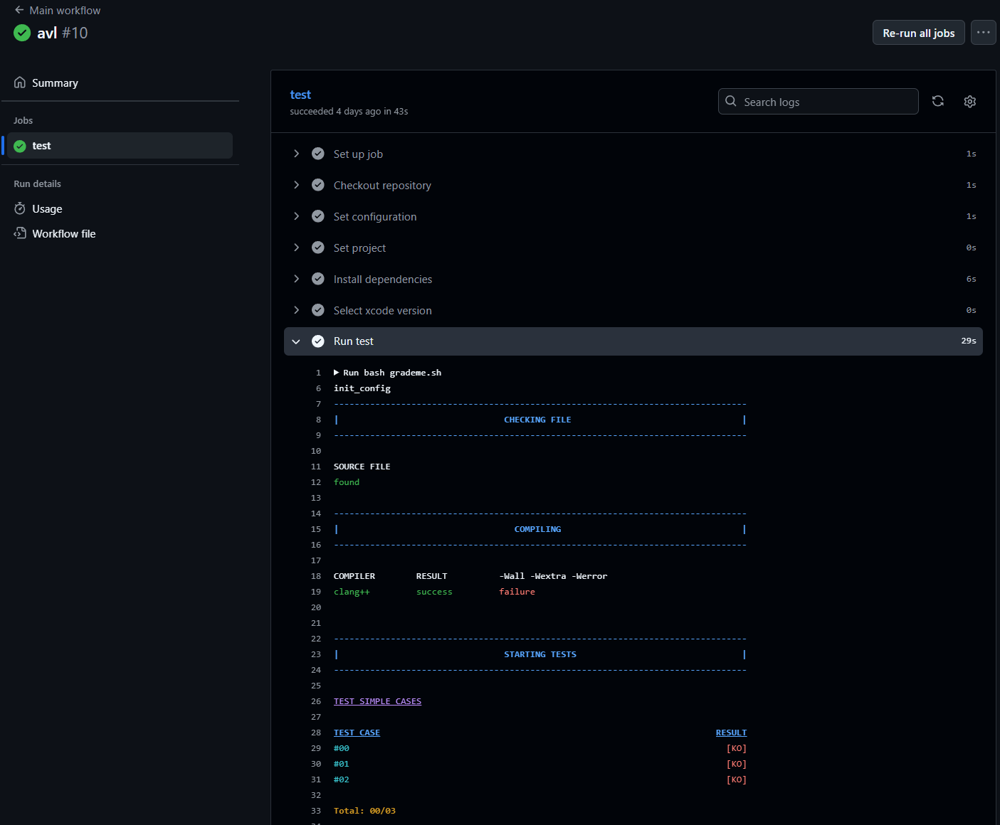
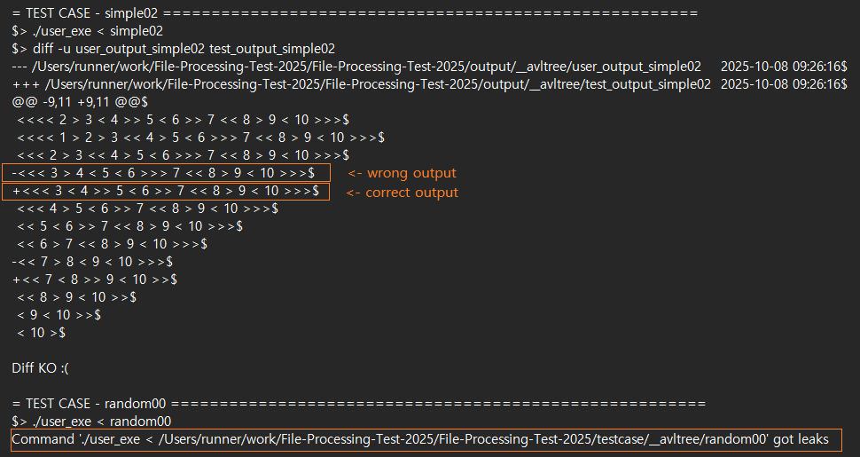
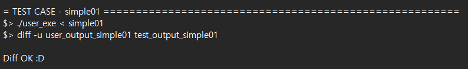

# 화일처리 리포트 테스터 (ver 2025)

이 저장소는 KMU 화일처리 과목의 리포트를 테스트하기 위한 스크립트를 포함하고 있습니다.

</br>


<div>
	<strong>소스 코드는 반드시 </strong>
	<code>C/C++ 언어</code> 
	<strong>로 작성되어야 하며, 파일 이름은 </strong>
	<code>main.c</code> 
	<strong>또는 </strong>
	<code>main.cpp</code>
	<strong>이어야 합니다.</strong>
	<br>
	<br>
	<p>스크립트는 다음과 같은 테스트를 수행합니다:</p>
	<ul>
		<li>소스 파일 존재 여부 확인</li>
		<li>소스 파일 컴파일 여부 확인</li>
		<li>프로그램 출력 테스트</li>
	</ul>
	<p>모든 테스트가 끝나면 <code>deepthought</code> 파일이 생성되며, 이 안에서 결과와 오류/실패 메시지를 확인할 수 있습니다.</p>
</div>

</br>
</br>
</br>
</br>
</br>
</br>
</br>
</br>
</br>
</br>

# 지원 플랫폼

GitHub Actions를 사용하지 않는 경우, 아래 플랫폼 요구사항을 참고하세요.

</br>

## 운영체제 (Operating System)

MacOS-sequoia15.0

</br>

## 컴파일러 (Compiler)

Apple clang version 16.0.0 (clang-1600.0.26.3)

Target: arm64-apple-darwin24.1.0

Thread model: posix

InstalledDir: /Library/Developer/CommandLineTools/usr/bin

</br>

## 소프트웨어 개발 키트 (SDK)

이 테스터는 아래의 **비표준 SDK (Non-standard SDK)** 로 개발되었습니다.  
다른 SDK 환경에서는 정상적으로 작동하지 않을 수 있습니다.

```
$ ls /Library/Developer/CommandLineTools/SDKs

MacOSX.sdk MacOSX14.5.sdk MacOSX14.sdk MacOSX15.0.sdk MacOSX15.sdk
```

</br>
</br>
</br>
</br>

# 시작하기 (Getting Started)

## 설치 (Installation)

### 로컬 환경에서 실행하기 (Local machine)

로컬 환경에서 테스트하려면 이 저장소를 `clone` 하세요.  
단, 위에 명시된 플랫폼과 동일한 환경이 필요할 수 있습니다.

```
https://github.com/KMU-File-Processing/File-Processing-Report-Tester.git
```

</br>

### GitHub Actions (권장)

GitHub Actions를 사용하여 프로젝트를 테스트할 수 있습니다.  
아래의 템플릿 링크를 주소창에 입력하여 프로젝트를 생성하세요.

```
https://github.com/KMU-File-Processing/File-Processing-Report-Tester/generate
```

❗️❗️❗️반드시 **PRIVATE 저장소**로 생성해야 합니다❗️❗️❗️

</br>

## 설정 (Configuration)

스크립트를 처음 실행하면 `my_config.sh` 파일이 자동으로 생성됩니다.  
이 파일을 열어, 테스트할 코드가 있는 디렉토리 경로를 수정해주면 됩니다.  
Github Actions에서 실행할 경우 이 단계는 건너뛰어도 됩니다.

</br>

## 테스트 케이스 (Testcase)

[testcase](testcase) 디렉토리에 직접 테스트 케이스를 추가할 수 있습니다.  
스크립트는 해당 디렉토리 내의 모든 테스트 케이스를 자동으로 실행합니다.

</br>
</br>
</br>
</br>

# 테스트 실행 (Running tests)

## 로컬 환경에서 실행 (Local Machine)

저장소를 클론한 디렉토리로 이동하여 아래 명령어를 실행합니다.

```
bash grademe.sh
```

또는 절대 경로를 사용하여 실행할 수도 있습니다.

```
bash /path/where/you/cloned/grademe.sh
```

</br>

## GitHub Actions에서 실행 (Github Actions)

소스 코드를 `submit` 디렉토리에 넣으면 됩니다.

</br>

### 자동 테스트 (Automatic Test)

소스 코드를 저장소에 `push` 하면 GitHub Actions가 자동으로 테스트를 수행합니다.  
기본 테스트 프로젝트는 `__bstree`이며, [main.yml](.github/workflows/main.yml) 파일에서 변경할 수 있습니다.

</br>

### 수동 테스트 (Manual Test)

아래 명령어를 사용하거나, GitHub 저장소의 **Actions 탭**에서 직접 실행할 수도 있습니다.

```
gh workflow run main.yml -f project="project_to_test"
```


</br>

### 결과 확인 (Result)

테스트 결과는 GitHub 저장소의 **Actions 탭**에서 확인할 수 있습니다.  
결과 파일인 `deepthought`는 `artifacts` 섹션에 생성됩니다.

</br>
</br>



</br>

Github Actions 탭에 들어가면 위 사진과 같이 완료된 work flow들이 나타납니다.  
각 work flow들을 클릭하여 채점 결과를 확인할 수 있습니다.

</br>
</br>


</br>
</br>

확인하고 싶은 테스트 결과를 클릭하면 위 사진과 같은 창이 나옵니다.  
위 사진에서 강조된 test라고 적혀있는 버튼을 누르면 

</br>
</br>



</br>

테스트 채점 결과를 확인할 수 있습니다.

deepthought을 다운로드하여 더 자세한 결과를 확인할 수 있습니다.

</br>
</br>



</br>

deepthought 파일의 예시 결과입니다. 제출한 코드가 잘못된 출력을 했을 경우 정답 출력과 비교하여 보여줍니다.  
'-' 뒤에 출력되는 줄은 제출한 코드가 출력한 틀린 출력입니다.  
'+' 뒤에 출력되는 줄은 정답에 해당되는 출력입니다.  
밑에 강조된 부분은 random test case에서 메모리 누수가 발견되었음을 알려줍니다.

이런 에러 메시지들을 잘 확인하시고 코드를 수정하시면 됩니다.

</br>
</br>



</br>

위 사진은 테스트에 통과되었을 때 출력되는 메시지를 보여줍니다.


</br>
</br>
</br>
</br>

# 라이선스 (License)

이 프로젝트는 MIT 라이선스 하에 배포됩니다.  
자세한 내용은 [LICENSE](LICENSE) 파일을 참고하세요.

</br>
</br>
</br>
</br>

# 문의 (Contact)

문의사항이 있으시면 아래 메일로 연락해주세요.  
<mailto:jch618@kookmin.ac.kr>

여러분의 기여는 언제나 환영합니다! 🎉
